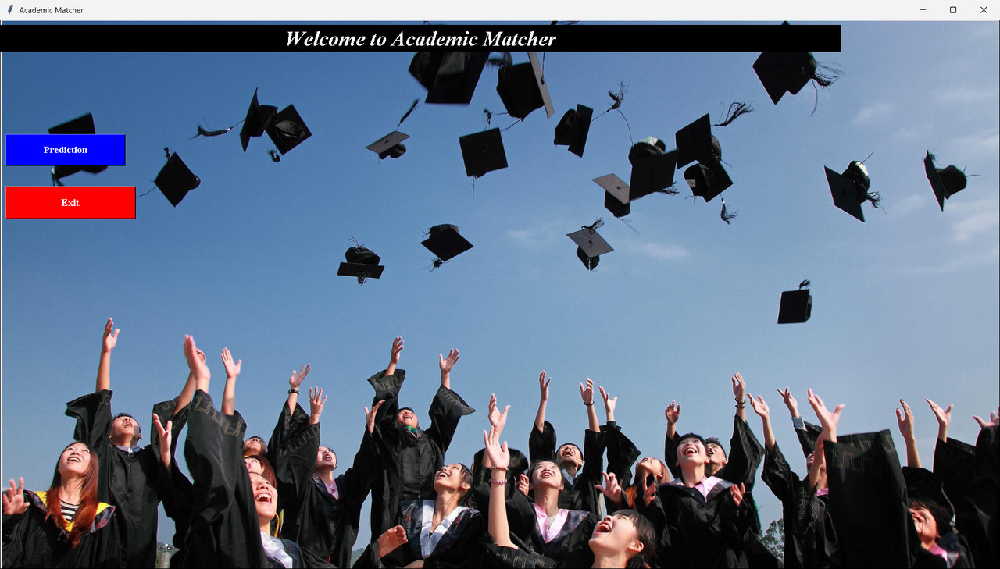
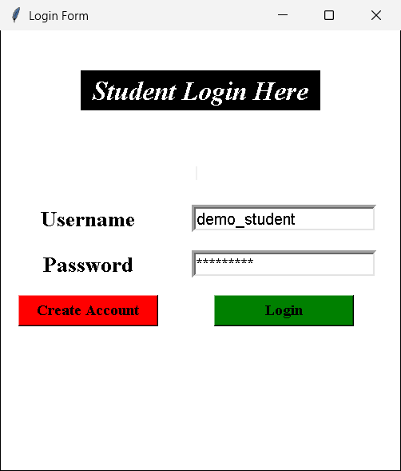
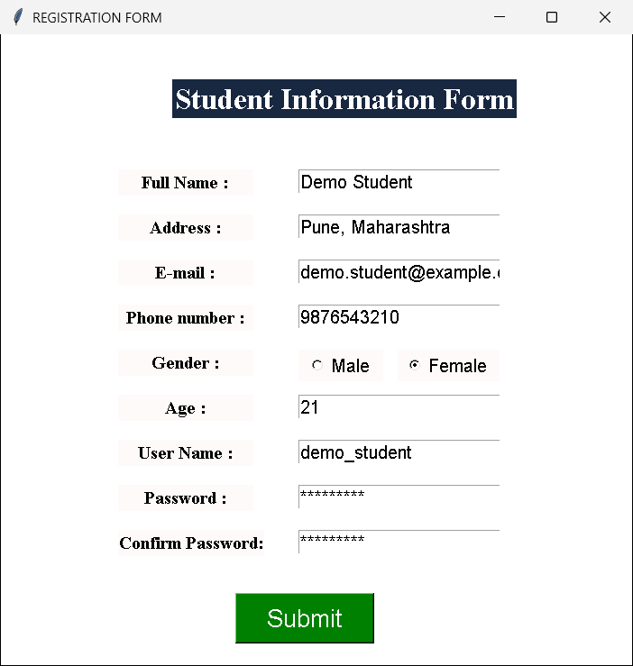
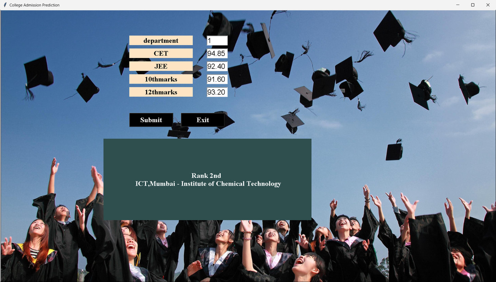

# Cut-Off Based College Recommendation System

A desktop application (Tkinter GUI) that predicts/recommends colleges to students based on their academic cut-off marks, using machine learning classification models.

## Screenshots

**Home screen**



**Student registration and login** (SQLite-backed)

| Login | Registration |
| --- | --- |
|  |  |

**Prediction** — enter department, CET / JEE and 10th & 12th marks, and the trained classifier returns a ranked college recommendation.



## Features

- User registration and login (SQLite-backed)
- College admission prediction using multiple ML models:
  - Support Vector Machine (SVM)
  - Random Forest Classifier
  - Decision Tree Classifier
- Model training pipeline with accuracy/classification reports (`train.py`)
- Simple, animated Tkinter GUI with video splash screen

## Tech Stack

- Python, Tkinter (GUI)
- scikit-learn (SVM, Random Forest, Decision Tree)
- pandas, numpy
- SQLite (user auth)
- OpenCV / tkvideo (video playback), Pillow (images)

## Project Structure

```
GUI_main.py          Entry point - launches the main GUI
login.py              Login screen
registration.py       User registration screen
train.py               Model training (SVM / RF / DT)
Check_Prediction.py   Runs prediction using trained models
*.joblib               Pre-trained model files
Admission_Predict.csv  Dataset
dataset.csv
train.csv
assets/                 UI images
demo/                   Background clips used by the splash screen
screenshots/            README screenshots
```

## Getting Started

```bash
pip install -r requirements.txt
python GUI_main.py
```
